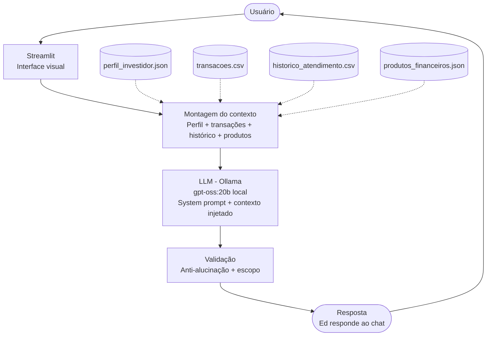

# 💸 CashEd — Seu Educador Financeiro com IA

Agente de IA educativo que ensina conceitos de finanças pessoais de forma simples e personalizada, usando os dados do próprio cliente como exemplos práticos.

> **Importante:** O CashEd **não recomenda investimentos**. Ele explica, ensina e contextualiza — como um professor paciente que nunca julga seus gastos.

---

## O Problema

A maioria das pessoas nunca teve acesso a uma educação financeira de qualidade. Conceitos como reserva de emergência, tipos de investimento e organização de gastos parecem complicados — mas não precisam ser.

## A Solução

O CashEd (Ed, pra quem é chegado) é um chatbot educativo que:

- Explica conceitos financeiros com linguagem simples e acessível
- Usa as transações e o perfil do próprio cliente como exemplos reais
- Admite quando não sabe algo, em vez de inventar
- Nunca sai do tema — foco total em educação financeira

---

## Arquitetura

| Componente | Tecnologia |
|------------|------------|
| Interface | Streamlit |
| LLM | Ollama (local) |
| Base de conhecimento | JSON + CSV (dados mockados) |

## Fluxograma de Arquitetura



---

## Base de Conhecimento

| Arquivo | Uso |
|---------|-----|
| `data/perfil_investidor.json` | Personalizar as explicações ao perfil do cliente |
| `data/transacoes.csv` | Exemplos práticos com os gastos reais do cliente |
| `data/produtos_financeiros.json` | Explicar os produtos disponíveis (sem recomendar) |
| `data/historico_atendimento.csv` | Contextualizar atendimentos anteriores |

---

## Como Rodar

**1. Instalar o Ollama e baixar o modelo:**
```bash
ollama pull gpt-oss:20b
```

**2. Instalar dependências:**
```bash
pip install -r requirements.txt
```

**3. Rodar a aplicação:**
```bash
streamlit run src/app.py
```

---

## System Prompt

O comportamento do Ed é definido por um prompt simples e direto:

- Linguagem acessível, como se explicasse para uma criança
- Máximo de 2 parágrafos por resposta
- Jamais recomenda investimentos — apenas explica como funcionam
- Fora do tema de finanças? Redireciona educadamente
- Não sabe algo? Admite e explica o que pode

---

## Estrutura do Repositório

```
📁 lab-agente-financeiro/
├── data/                        # Dados mockados do cliente
├── docs/                        # Documentação completa do agente
│   ├── 01-documentacao-agente.md
│   ├── 02-base-conhecimento.md
│   ├── 03-prompts.md
│   ├── 04-metricas.md
│   └── 05-pitch.md
└── src/
    └── app.py                   # Código da aplicação
```

---

## Limitações Declaradas

- Não faz recomendações de investimento
- Não acessa dados bancários reais
- Não substitui um profissional qualificado

---

Feito com 💚 por Marcos Abbade — Desafio DIO: Agente Inteligente com IA Generativa
